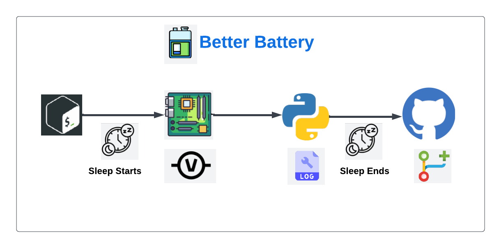
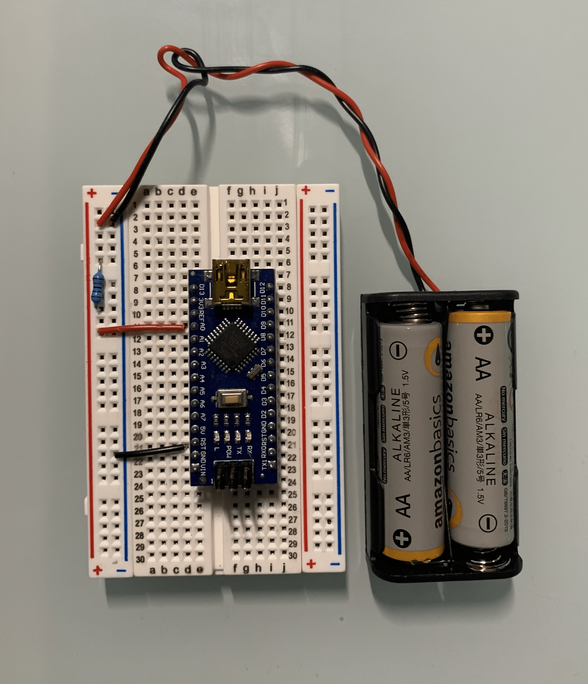

## Better Battery

Better Battery is a creative way to use GitHub for tracking the remaining charge of batteries.

## Table of Contents

1. [Description](#description)
2. [Acknowledgements](#ack)
3. [Technologies](#tech)
4. [Process Overview](#process)
5. [Circuit](#circuit)
6. [Future Work](#future)

## Description 

One of GitHub's main features is the ability to track any changes made in code repositories.

The theme of tracking changes has inspired me to think outside the box and come up with a creative way to use GitHub.

One question I asked myself is _What things do I care to track changes over time?_

As I used my phone to try and conjure up ideas, I noticed my battery was about to die.

Then it hit me, **Batteries!**

Better Battery utilizes GitHub to track the remaining charge in batteries over time so that anyone can better their understanding of battery utilization!

## Acknowledgements 

Better Battery won 1st place at the University of North Texas `22 NSBE Hackathon in the

*Most Creative Use of GitHub* challenge!

## Technologies 

Better Battery was built by using a number of different technologies:

- An Arduino Nano for taking input of battery voltage

- GitHub for tracking the changes of a batteries power

- Python for communication between the host computer and the Arduino

- Bash for automation of commits and pushes to GitHub

## Process Overview 

This process begins by:

1. Executing a bash script that will sleep for 30 seconds
2. Arduino reading in the voltage of a battery from the circuit
3. Python script to write the voltages to a file
4. Bash script wakes up to perform the git add, commit, and push to github

*Execution flow of processes for better battery*

## Circuit 

*10K Ohm resistor connected to A0 pin and common ground*

**Note:** Circuit can accommodate up to 5 volts

## Future Work 

Future improvements for Better Battery are:

- Improved UI for user's to visualize their battery's remaining change

- Implement a wider range of batteries to test

- Faster testing platform
